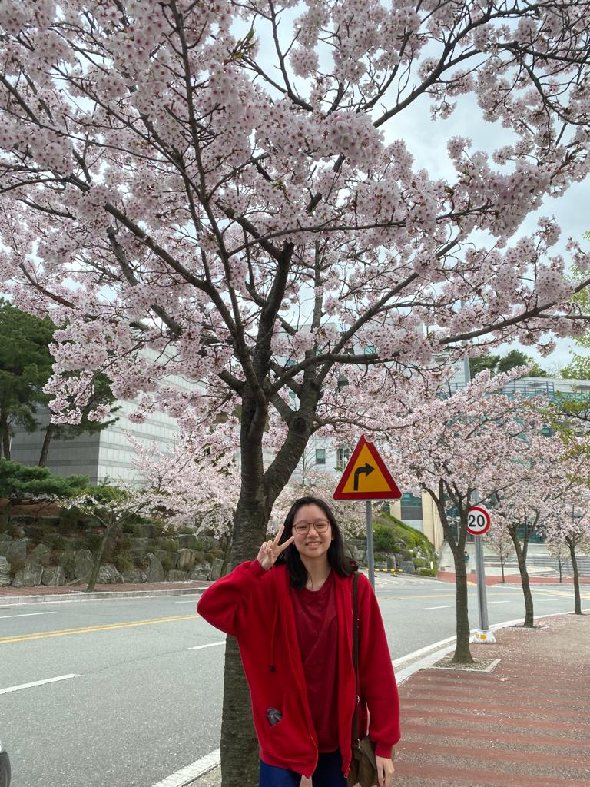

> I'm the one in white, I currently dont have a photo with only me so pardon this group photo 

## Hello, My Name is Deby Angelina

I'm a senior at Dankook University and a soon to be software engineer and/or developer, from Semarang, Indonesia. I enjoy debugging and solving complex problems, especially the ecstatic and proud feeling when I finally overcome them. In addition, I'm a resourceful being, one that makes the most of its surrounding, be it people, knowledge, or technology(like google :>); in a positive way.

> When I'm not coding or racking my brain, you'll find me in the virtual world *(aka MOBA games)* or doing art stuff

## Projects

here are some of my note worthy projects from my programming classes:
1. Shopping App - [Compareit](https://github.com/debdeb18/compareit-frontend-react)(JavaScript, React) 
2. Android Game - [Sloppy](https://github.com/debdeb18/sloppy-game)(Java, JNI)
3. MIPS - [Single cycle](https://github.com/debdeb18/MIPS-single-cycle-implementation-in-C), [Pipeline](https://github.com/debdeb18/MIPS-pipeline-implementation-in-C), [Simple Calc](https://github.com/debdeb18/simple-calculator)(C)
4. Program OOP - [Vending Machine](https://github.com/debdeb18/vending-macine-OOP-project)(C++)

## Information

Check out my resume [here](https://drive.google.com/file/d/1ehosL04m51oQFNTltxDc5y1ID40IK3t8/view?usp=sharing)

or reach out to me via

&emsp;
